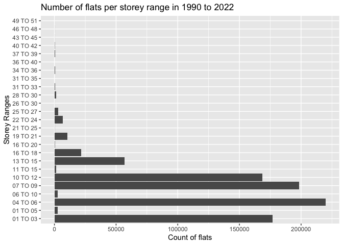

Singapore HDB Resale Flat Prices for 1990 - 2022
================

- <a href="#introduction" id="toc-introduction">Introduction</a>
- <a href="#data-exploration" id="toc-data-exploration">Data
  Exploration</a>
- <a href="#exploratory-data-analysis"
  id="toc-exploratory-data-analysis">Exploratory Data Analysis</a>
  - <a href="#analyses-for-2010---2022"
    id="toc-analyses-for-2010---2022">Analyses for 2010 - 2022</a>
  - <a href="#choosing-feature-variables-to-predict-hdb-resale-prices"
    id="toc-choosing-feature-variables-to-predict-hdb-resale-prices">Choosing
    feature variables to predict HDB resale prices</a>
- <a
  href="#predicting-hdb-apartment-resale-prices-for-the-years-of-2010---2022"
  id="toc-predicting-hdb-apartment-resale-prices-for-the-years-of-2010---2022">Predicting
  HDB apartment resale prices for the years of 2010 - 2022</a>

## Introduction

As a millenial growing up in Singapore and starting out in my first job,
one of my life’s goals is to own a house on this little red dot with my
life partner (*read: wife*).

Here in [Singapore](https://en.wikipedia.org/wiki/Singapore), there are
generally [two
ways](https://www.propertyguru.com.sg/property-guides/the-different-types-of-housing-in-singapore-9916)
to do this:

- [Public
  Housing](https://www.hdb.gov.sg/about-us/our-role/public-housing-a-singapore-icon)
  - Brand new Built-to-Order (BTO) Flats (or apartments)
  - Resale Flats
- Private Housing (e.g., condominiums, landed property, etc.)

Whilst BTOs tend to be the choice of most young Singaporean couples, my
current and potential future situation may push my partner and I to look
towards resale flats to meet our housing needs. As such, I set forth on
this project that will focus on resale flats under the Housing &
Development Board (HDB). I hope to uncover insights into the
relationships between variables related to resale flat prices and
whether the data can be fitted into a model that may give an idea of
future prices.

This project therefore seeks to analyse the prices of Singapore’s HDB
Resale Flats for the years of 1990 - 2022. Data was obtained from
Kaggle,
[(1)](https://www.kaggle.com/datasets/syrahmadi/resale-hdb-flat-prices-2000-2022)
and
[(2)](https://www.kaggle.com/datasets/chngyuanlongrandy/hdb-prices-with-closest-mrt-distance),
which were sourced from GovTech’s open data portal,
[data.gov.sg](https://data.gov.sg/dataset/resale-flat-prices).

## Data Exploration

First, we will examine the data to understand its structure and
contents.

    ## # A tibble: 6 × 10
    ##   month   town     flat_…¹ block stree…² store…³ floor…⁴ flat_…⁵ lease…⁶ resal…⁷
    ##   <chr>   <chr>    <chr>   <chr> <chr>   <chr>     <dbl> <chr>     <dbl>   <dbl>
    ## 1 1990-01 ANG MO … 1 ROOM  309   ANG MO… 10 TO …      31 IMPROV…    1977    9000
    ## 2 1990-01 ANG MO … 1 ROOM  309   ANG MO… 04 TO …      31 IMPROV…    1977    6000
    ## 3 1990-01 ANG MO … 1 ROOM  309   ANG MO… 10 TO …      31 IMPROV…    1977    8000
    ## 4 1990-01 ANG MO … 1 ROOM  309   ANG MO… 07 TO …      31 IMPROV…    1977    6000
    ## 5 1990-01 ANG MO … 3 ROOM  216   ANG MO… 04 TO …      73 NEW GE…    1976   47200
    ## 6 1990-01 ANG MO … 3 ROOM  211   ANG MO… 01 TO …      67 NEW GE…    1977   46000
    ## # … with abbreviated variable names ¹​flat_type, ²​street_name, ³​storey_range,
    ## #   ⁴​floor_area_sqm, ⁵​flat_model, ⁶​lease_commence_date, ⁷​resale_price

    ## # A tibble: 6 × 10
    ##   month   town     flat_…¹ block stree…² store…³ floor…⁴ flat_…⁵ lease…⁶ resal…⁷
    ##   <chr>   <chr>    <chr>   <chr> <chr>   <chr>     <dbl> <chr>     <dbl>   <dbl>
    ## 1 2000-01 ANG MO … 3 ROOM  170   ANG MO… 07 TO …      69 Improv…    1986  147000
    ## 2 2000-01 ANG MO … 3 ROOM  174   ANG MO… 04 TO …      61 Improv…    1986  144000
    ## 3 2000-01 ANG MO … 3 ROOM  216   ANG MO… 07 TO …      73 New Ge…    1976  159000
    ## 4 2000-01 ANG MO … 3 ROOM  215   ANG MO… 07 TO …      73 New Ge…    1976  167000
    ## 5 2000-01 ANG MO … 3 ROOM  218   ANG MO… 07 TO …      67 New Ge…    1976  163000
    ## 6 2000-01 ANG MO … 3 ROOM  320   ANG MO… 04 TO …      73 New Ge…    1977  157000
    ## # … with abbreviated variable names ¹​flat_type, ²​street_name, ³​storey_range,
    ## #   ⁴​floor_area_sqm, ⁵​flat_model, ⁶​lease_commence_date, ⁷​resale_price

    ## # A tibble: 6 × 10
    ##   month   town     flat_…¹ block stree…² store…³ floor…⁴ flat_…⁵ lease…⁶ resal…⁷
    ##   <chr>   <chr>    <chr>   <chr> <chr>   <chr>     <dbl> <chr>     <dbl>   <dbl>
    ## 1 2012-03 ANG MO … 2 ROOM  172   ANG MO… 06 TO …      45 Improv…    1986  250000
    ## 2 2012-03 ANG MO … 2 ROOM  510   ANG MO… 01 TO …      44 Improv…    1980  265000
    ## 3 2012-03 ANG MO … 3 ROOM  610   ANG MO… 06 TO …      68 New Ge…    1980  315000
    ## 4 2012-03 ANG MO … 3 ROOM  474   ANG MO… 01 TO …      67 New Ge…    1984  320000
    ## 5 2012-03 ANG MO … 3 ROOM  604   ANG MO… 06 TO …      67 New Ge…    1980  321000
    ## 6 2012-03 ANG MO … 3 ROOM  154   ANG MO… 01 TO …      68 New Ge…    1981  321000
    ## # … with abbreviated variable names ¹​flat_type, ²​street_name, ³​storey_range,
    ## #   ⁴​floor_area_sqm, ⁵​flat_model, ⁶​lease_commence_date, ⁷​resale_price

    ## # A tibble: 6 × 11
    ##   month   town     flat_…¹ block stree…² store…³ floor…⁴ flat_…⁵ lease…⁶ remai…⁷
    ##   <chr>   <chr>    <chr>   <chr> <chr>   <chr>     <dbl> <chr>     <dbl>   <dbl>
    ## 1 2015-01 ANG MO … 3 ROOM  174   ANG MO… 07 TO …      60 Improv…    1986      70
    ## 2 2015-01 ANG MO … 3 ROOM  541   ANG MO… 01 TO …      68 New Ge…    1981      65
    ## 3 2015-01 ANG MO … 3 ROOM  163   ANG MO… 01 TO …      69 New Ge…    1980      64
    ## 4 2015-01 ANG MO … 3 ROOM  446   ANG MO… 01 TO …      68 New Ge…    1979      63
    ## 5 2015-01 ANG MO … 3 ROOM  557   ANG MO… 07 TO …      68 New Ge…    1980      64
    ## 6 2015-01 ANG MO … 3 ROOM  603   ANG MO… 07 TO …      67 New Ge…    1980      64
    ## # … with 1 more variable: resale_price <dbl>, and abbreviated variable names
    ## #   ¹​flat_type, ²​street_name, ³​storey_range, ⁴​floor_area_sqm, ⁵​flat_model,
    ## #   ⁶​lease_commence_date, ⁷​remaining_lease

    ## # A tibble: 6 × 11
    ##   month   town     flat_…¹ block stree…² store…³ floor…⁴ flat_…⁵ lease…⁶ remai…⁷
    ##   <chr>   <chr>    <chr>   <chr> <chr>   <chr>     <dbl> <chr>     <dbl> <chr>  
    ## 1 2017-01 ANG MO … 2 ROOM  406   ANG MO… 10 TO …      44 Improv…    1979 61 yea…
    ## 2 2017-01 ANG MO … 3 ROOM  108   ANG MO… 01 TO …      67 New Ge…    1978 60 yea…
    ## 3 2017-01 ANG MO … 3 ROOM  602   ANG MO… 01 TO …      67 New Ge…    1980 62 yea…
    ## 4 2017-01 ANG MO … 3 ROOM  465   ANG MO… 04 TO …      68 New Ge…    1980 62 yea…
    ## 5 2017-01 ANG MO … 3 ROOM  601   ANG MO… 01 TO …      67 New Ge…    1980 62 yea…
    ## 6 2017-01 ANG MO … 3 ROOM  150   ANG MO… 01 TO …      68 New Ge…    1981 63 yea…
    ## # … with 1 more variable: resale_price <dbl>, and abbreviated variable names
    ## #   ¹​flat_type, ²​street_name, ³​storey_range, ⁴​floor_area_sqm, ⁵​flat_model,
    ## #   ⁶​lease_commence_date, ⁷​remaining_lease

From these, we see that the data structure is generally similar. The
only difference being that the “Jan 2015 - Dec 2016” and “Jan 2017
onwards” data consists of an extra column `remaining_lease`, indicating
the remaining years of lease for the houses in the datasets. For the
purpose of this project then, we will be dropping this column to
maintain data uniformity.

Now that the data is similar, we can combine the datasets together.
Looking into the dataset, we see that the `storey_range` variable has
varied values, which we will be renaming into a new variable called
`storeys`.

However, before we create the new variable, it would be helpful to
understand the range of storey ranges among the resale flats and create
a new variable to categorise them.

Even in 2022, very few resale flats have more than 12 to 15 floors,
hence, everything above the 9th floor will be tagged as *“high”*.

## Exploratory Data Analysis

Now that the data is cleaned, we can do some quick exploratory analyses.

First, we know that generally, HDB flat prices tend to vary by storey
levels. We can visualise this layman assumption here:

Although the variation and range of resale flat prices are relatively
the same, the median prices for each of the storey categories seem to
fit this assumption. That is, HDB flats on the lower levels generally
tend to cost less than those on the higher levels.

One possible explanation for near similar variations and ranges could be
the scope of the dataset, which covers approximately 30 years’ worth of
data. Furthermore, the above chart does not take into account the HDB
town, which, as most Singaporeans know, also influences the prices of
flats.

Let’s examine the relationship between HDB towns and prices next:

It is therefore evident that HDB resale flat prices do vary by their
towns.

At this point, as mentioned above, the range of data is still massive
with about 871,671 observations. For ease of and more focused analyses,
we will narrow down the dataset by three conditions:

- Apartments from 2010 onwards (because we want newer houses and
  buildings)
- Apartments of at least 4-room and not multi-generation (so that we
  have a flat that is big enough to house at least 2 children)
- Apartments located on “mid” or “high” storeys (as we simply prefer
  being higher up and for the higher resale value over time)

<!-- -->

    ## # A tibble: 6 × 13
    ##   month    year town       flat_…¹ flat_…² block stree…³ store…⁴ storeys floor…⁵
    ##   <chr>   <int> <chr>      <chr>   <fct>   <chr> <chr>   <chr>   <fct>     <dbl>
    ## 1 2010-01  2010 ANG MO KIO 4 ROOM  4-room  414   ANG MO… 07 TO … mid          92
    ## 2 2010-01  2010 ANG MO KIO 4 ROOM  4-room  472   ANG MO… 13 TO … high         92
    ## 3 2010-01  2010 ANG MO KIO 4 ROOM  4-room  624   ANG MO… 10 TO … high         93
    ## 4 2010-01  2010 ANG MO KIO 4 ROOM  4-room  643   ANG MO… 07 TO … mid         100
    ## 5 2010-01  2010 ANG MO KIO 5 ROOM  5-room  418   ANG MO… 07 TO … mid         148
    ## 6 2010-01  2010 ANG MO KIO 5 ROOM  5-room  545   ANG MO… 13 TO … high        118
    ## # … with 3 more variables: flat_model <chr>, lease_commence_date <dbl>,
    ## #   resale_price <dbl>, and abbreviated variable names ¹​flat_type, ²​flat_type2,
    ## #   ³​street_name, ⁴​storey_range, ⁵​floor_area_sqm

This gives us a dataset with 38,695 observations - something much easier
to work with and relatively more reflective of current trends,
considering the recency of the data.

### Analyses for 2010 - 2022

Here, we repeat the analyses from the previous section using the
filtered dataset.

We also add another analysis:

We can make three observations here:

For HDB Resale Flats sold from 2010 onwards,

1.  Apartments on higher floors (i.e., at least 11th floor) tend to be
    priced SGD 40,000 more than those on middle floors (i.e., 6th to
    10th floors)
2.  Apartments in the areas nearer to the Central Business District
    (CBD) area of Singapore tend to be priced more than those further
    away, with those in mature estates priced higher than those in
    non-mature estates (see
    [here](https://www.propertyguru.com.sg/property-guides/non-mature-vs-mature-bto-55760)
    for a list of such estates)
3.  Apartments with larger flat types tend to be priced higher than
    relatively smaller ones

Another interesting observation is with the spread of resale prices by
HDB towns.

Let’s take a look at both the unfiltered (left) and filtered (right)
data visualisations side by side:

We see that when comparing the range of HDB resale flat prices for 1990
to 2022 vs. for 2010 to 2022, the second observation above does not
hold. The simple explanation here is that, many estates (e.g., Punggol,
Sengkang, Central Area) did not have many HDB flats built prior to 2010
(or even 2000).

As Singapore developed further, with land scarcity increasing, more HDB
flats needed to be built closer to the CBD to meet the demands of
working professionals whose offices were located there. As such, even
mature estates such as Queenstown and Bukit Merah, being some of the
oldest estates in Singapore, with their newly developed HDB flats in the
early 2000s, started seeing increased resale prices due to their
proximity to the CBD. Furthermore, with the development of Sengkang and
Punggol in line with more recent trends in HDB resale flat prices, these
newer flats came out on top in terms of resale prices when being
compared to flats that were built long before 2010, or even 2000.

This brings us to another variable that we have not investigated: the
lease commencement date. The years variable used thus far were the years
that the HDB flat was put on the resale market. As such, the lease
commencement date would give an indicator of the age of the HDB flat.

Let’s take a look at the visualisation here:

The plot above shows that there is a general upward trend for newer HDB
flats, which by common logic, does make sense. The only “outlier” in
this plot is that of HDB resale flats in Sembawang, which saw a downward
trend followed by a spike in the late 2010s. This could have been due to
recent urban developments in the Canberra area, located near Sembawang.

Nevertheless, when looking at the data as a whole, it still shows that
the resale prices increased for newer HDB resale flats (rho = 0.251, *p*
\< 0,05).

    ## 
    ##  Spearman's rank correlation rho
    ## 
    ## data:  filtered_data$lease_commence_date and filtered_data$median_price_by_lease
    ## S = 7.2359e+12, p-value < 2.2e-16
    ## alternative hypothesis: true rho is not equal to 0
    ## sample estimates:
    ##       rho 
    ## 0.2506549

Finally, we can also examine whether the HDB resale prices follow a
pattern or trend over time.

#### Insights from EDA of resale apartments from 2010 onwards

1.  Apartments on higher floors tend to be priced higher (at least SGD
    40,000 more between high and middle floors)
2.  Apartments nearer to the CBD tend to be priced higher than those
    futher away
3.  Apartments in mature estates tend to be priced higher than those in
    non-mature estates
4.  Apartments with larger flat types tend to be priced higher than
    relatively smaller ones
5.  Newer apartments tend to be priced higher than relatively older ones
    (i.e., with shorter remaining lease years)
6.  Resale prices generally dip at the end of the year and then dip
    again at around mid-year
7.  Executive apartment resale prices are more volatile (variable) than
    4-room and 5-room apartment resale prices

### Choosing feature variables to predict HDB resale prices

In predicting HDB resale prices, the exploratory analyses revealed some
key variables:

- Flat-type (e.g., 4-room, 5-room, Executive)
  - This variable is synonymous with the floor area of the house, which
    is represented by the `floor_area_sqm` variable
- Month of sale
- Year of lease commencement (i.e., indicating the remaining length of
  the house lease at point of sale)
- Storeys (e.g., Mid or High floors)
- Region (i.e., indicated by Town, which indicates proximity to the CBD)

Out of these variables, we will need to create or calculate new
variables for the length of housing lease at point of sale and for the
housing region.

For the town groupings by region, we will use the information found
[here](https://en.wikipedia.org/wiki/Regions_of_Singapore).

As such, the feature variables we will be using to predict HDB resale
prices would be:

- Flat Type (`flat_type2`)
- Floor area in sqm (`floor_area_sqm`)
- Remaining lease length in years (`remaining_lease_length`)
- Region (`region`)
- Floor level (`storeys`)
- Month of sale (`month_year`)

Since flat type and floor area are synonymous, we can conduct an ANOVA
test on both variables to test for feature dependence and consider
whether we should use both variables as features in a model or only one.

For this ANOVA test, we will set our alpha level to 0.1 and the null
hypothesis that there is no difference between the means of the floor
area for the flat types.

    ## Analysis of Variance Table
    ## 
    ## Response: floor_area_sqm
    ##               Df  Sum Sq Mean Sq F value    Pr(>F)    
    ## flat_type2     2 9370466 4685233   77207 < 2.2e-16 ***
    ## Residuals  38692 2347999      61                      
    ## ---
    ## Signif. codes:  0 '***' 0.001 '**' 0.01 '*' 0.05 '.' 0.1 ' ' 1

The ANOVA test showed that the p-value was less than 0.001 and so we can
reject the null hypothesis; concluding that there is a mean difference
between the floor area of flat types.

To determine which pairs of flat types had differences, we can conduct a
series pairwise t-test with Bonferroni correction. We will set alpha to
0.1 for this test.

    ## 
    ##  Pairwise comparisons using t tests with pooled SD 
    ## 
    ## data:  filtered_data$floor_area_sqm and filtered_data$flat_type2 
    ## 
    ##           4-room 5-room
    ## 5-room    <2e-16 -     
    ## Executive <2e-16 <2e-16
    ## 
    ## P value adjustment method: bonferroni

The pairwise t-tests showed p-values of less than 0.001 for all possible
pairs, which means that we can reject all null hypotheses that there
were no differences in mean floor areas between flat types. As such, we
will be keeping both variables for predicting HDB resale prices.

## Predicting HDB apartment resale prices for the years of 2010 - 2022

After exploring our data and gaining some insights into the trends and
factors possibly influencing resale prices, we will be modelling the
prices to predict them.

    ## 
    ## Call:
    ## lm(formula = resale_price ~ flat_type2 + floor_area_sqm + remaining_lease_length + 
    ##     region + storeys + month_year, data = filtered_data)
    ## 
    ## Residuals:
    ##     Min      1Q  Median      3Q     Max 
    ## -317148  -57051   -9467   44590  545288 
    ## 
    ## Coefficients:
    ##                          Estimate Std. Error t value Pr(>|t|)    
    ## (Intercept)            -2.914e+05  9.612e+03  -30.31   <2e-16 ***
    ## flat_type25-room        3.730e+04  1.629e+03   22.90   <2e-16 ***
    ## flat_type2Executive     8.957e+04  3.209e+03   27.91   <2e-16 ***
    ## floor_area_sqm          2.435e+03  5.950e+01   40.92   <2e-16 ***
    ## remaining_lease_length  3.572e+03  4.488e+01   79.59   <2e-16 ***
    ## regioneast             -1.824e+05  1.626e+03 -112.19   <2e-16 ***
    ## regionnorth            -2.806e+05  1.531e+03 -183.27   <2e-16 ***
    ## regionnorth-east       -2.183e+05  1.395e+03 -156.50   <2e-16 ***
    ## regionwest             -2.375e+05  1.402e+03 -169.42   <2e-16 ***
    ## storeyshigh             2.070e+04  9.244e+02   22.39   <2e-16 ***
    ## month_year              2.451e+01  3.150e-01   77.81   <2e-16 ***
    ## ---
    ## Signif. codes:  0 '***' 0.001 '**' 0.01 '*' 0.05 '.' 0.1 ' ' 1
    ## 
    ## Residual standard error: 85240 on 38684 degrees of freedom
    ## Multiple R-squared:  0.6411, Adjusted R-squared:  0.641 
    ## F-statistic:  6911 on 10 and 38684 DF,  p-value: < 2.2e-16

    ## 
    ## Call:
    ## lm(formula = resale_price ~ floor_area_sqm + remaining_lease_length + 
    ##     region + storeys + month_year, data = filtered_data)
    ## 
    ## Residuals:
    ##     Min      1Q  Median      3Q     Max 
    ## -320649  -58224   -9558   45518  561130 
    ## 
    ## Coefficients:
    ##                          Estimate Std. Error t value Pr(>|t|)    
    ## (Intercept)            -4.541e+05  7.659e+03  -59.29   <2e-16 ***
    ## floor_area_sqm          3.911e+03  2.590e+01  151.04   <2e-16 ***
    ## remaining_lease_length  3.795e+03  4.448e+01   85.33   <2e-16 ***
    ## regioneast             -1.861e+05  1.633e+03 -113.95   <2e-16 ***
    ## regionnorth            -2.815e+05  1.544e+03 -182.35   <2e-16 ***
    ## regionnorth-east       -2.162e+05  1.407e+03 -153.71   <2e-16 ***
    ## regionwest             -2.385e+05  1.414e+03 -168.68   <2e-16 ***
    ## storeyshigh             2.244e+04  9.306e+02   24.11   <2e-16 ***
    ## month_year              2.492e+01  3.178e-01   78.40   <2e-16 ***
    ## ---
    ## Signif. codes:  0 '***' 0.001 '**' 0.01 '*' 0.05 '.' 0.1 ' ' 1
    ## 
    ## Residual standard error: 86090 on 38686 degrees of freedom
    ## Multiple R-squared:  0.6339, Adjusted R-squared:  0.6338 
    ## F-statistic:  8372 on 8 and 38686 DF,  p-value: < 2.2e-16

    ## 
    ## Call:
    ## lm(formula = resale_price ~ flat_type2 + floor_area_sqm + remaining_lease_length + 
    ##     region + storeys, data = filtered_data)
    ## 
    ## Residuals:
    ##     Min      1Q  Median      3Q     Max 
    ## -368703  -58332  -10519   45576  599517 
    ## 
    ## Coefficients:
    ##                          Estimate Std. Error t value Pr(>|t|)    
    ## (Intercept)             194549.85    7857.41   24.76   <2e-16 ***
    ## flat_type25-room         42785.29    1750.30   24.45   <2e-16 ***
    ## flat_type2Executive     100957.37    3446.99   29.29   <2e-16 ***
    ## floor_area_sqm            2097.08      63.82   32.86   <2e-16 ***
    ## remaining_lease_length    3070.82      47.76   64.30   <2e-16 ***
    ## regioneast             -184876.16    1748.21 -105.75   <2e-16 ***
    ## regionnorth            -282901.15    1646.22 -171.85   <2e-16 ***
    ## regionnorth-east       -212547.30    1497.84 -141.90   <2e-16 ***
    ## regionwest             -238487.06    1507.36 -158.22   <2e-16 ***
    ## storeyshigh              25033.09     992.24   25.23   <2e-16 ***
    ## ---
    ## Signif. codes:  0 '***' 0.001 '**' 0.01 '*' 0.05 '.' 0.1 ' ' 1
    ## 
    ## Residual standard error: 91660 on 38685 degrees of freedom
    ## Multiple R-squared:  0.585,  Adjusted R-squared:  0.5849 
    ## F-statistic:  6058 on 9 and 38685 DF,  p-value: < 2.2e-16
